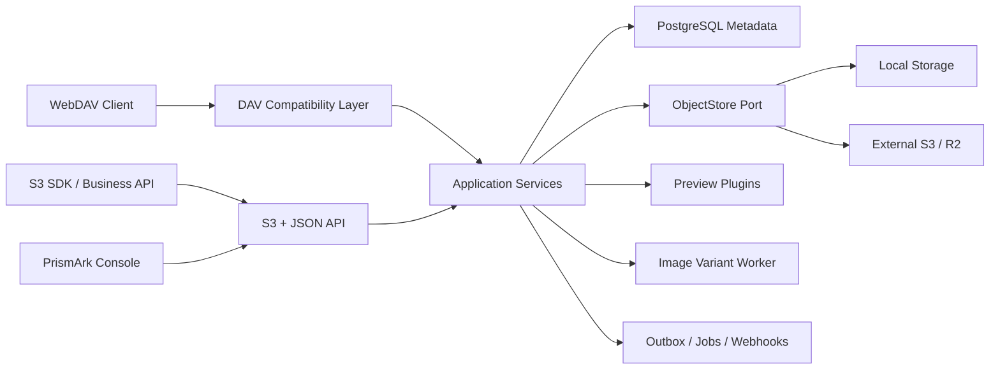

# PrismArk

<p align="center"></p>

> Store every object. See every facet.
> 存下每一个对象，看见内容的每一面。

**PrismArk（万象仓）** 是一套面向团队和 AI 应用的自托管对象存储与内容体验平台。它把对象存储、WebDAV、全格式文件预览和图片 Variant 放在同一个产品里：应用可以通过 API 或 SDK 保存对象，人在控制台中则可以像使用现代文件管理器一样浏览、预览和管理内容。

PrismArk 目前处于快速迭代阶段。现有版本已经具备可靠上传、Local/S3 存储后端、WebDAV、S3 核心对象闭环、图片 Variant、多格式预览、应用隔离、访问密钥和 Webhook。S3 网关已经覆盖 Bucket、Put/Get/Head/Copy/List/Delete/DeleteObjects、Multipart、版本与上传列表、三态 Versioning、null version、delete marker、版本级 Object Tagging、Bucket/Object Object Lock、Lifecycle 核心执行器与持久化 GC；Policy 和更多扩展操作仍在按照 [S3 修改方案](docs/mediahub-s3-modification-plan.md) 推进。

> 产品品牌已经更名为 PrismArk。当前代码中的 `mediahub-*` crate、`MEDIAHUB_*` 环境变量、镜像路径和部分 API 类型仍是技术标识，尚未机械重命名。本文保留这些真实标识，确保文档与当前实现一致；没有为旧品牌增加兼容代码。

## 为什么是 PrismArk

传统对象存储擅长保存和分发二进制，但人要理解文件时，通常还要下载到本地或接入多套转换服务。传统网盘擅长文件浏览，却不适合作为业务系统的数据面。

PrismArk 连接这两种体验：

- 对程序，它是具有 Application、Bucket、Object、Access Key 和签名 URL 的对象平台。
- 对人，它是带有文件夹导航、瀑布流、右键菜单和多格式预览的内容工作区。
- 对图片，它能从不可变原图生成可缓存、可重复的 Variant。
- 对未来 AI，它预留版本级派生产物、Metadata、任务和事件边界。

## 核心能力

### 对象存储与应用隔离

- 一个用户可以创建多个 Application。
- 每个 Application 独立拥有 Bucket、对象、Access Key、配额和 Webhook。
- 支持 Local 文件系统或外部 S3 兼容服务作为二进制存储后端。
- PostgreSQL 保存身份、策略、Metadata、任务、Variant 和一致性状态。
- 上传采用临时对象、校验和、原子提交与幂等控制。
- 支持普通上传、浏览器上传会话和 Multipart Upload。

### 现代文件浏览器

- 表格与 Win11 风格瀑布流两种视图。
- 基于对象 Key Prefix 的真实文件夹层级，而不是额外维护一套虚拟目录。
- Bucket 与目录面包屑、双击进入、返回上级。
- 文件类型视觉识别、多选、批量操作和分页；图片卡片按视口懒加载低成本 Variant 缩略图，并限制并发请求。
- 鼠标右键菜单、键盘 Enter/Space/Escape 操作。
- 从浏览器直接进入预览、详情、编辑与删除流程；预览窗口可用按钮或左右方向键连续浏览当前页文件。

### 全格式预览

预览是 PrismArk 的核心产品能力，不是对象列表旁边的附属功能。

| 类别 | 典型内容 | 预览方式 |
| --- | --- | --- |
| 图片 | JPEG、PNG、GIF、WebP、AVIF、SVG、HEIC、TIFF | 原图查看、适应窗口、图片 Variant |
| 文档 | PDF、DOCX、PPTX、Markdown、纯文本 | 分页或结构化阅读 |
| 表格 | XLSX、XLS、CSV | 浏览器 Worker 中只读解析 |
| 代码与配置 | JSON、YAML、XML、SQL、主流编程语言 | 语法高亮与文本查看 |
| 数据库 | SQLite | 浏览器沙箱中的只读表与查询体验 |
| 归档 | ZIP、7z 及常见压缩格式 | 目录树浏览与按需读取 |
| 音视频 | 浏览器支持的音视频格式 | 内嵌播放 |
| 三维与其他内容 | Open File Viewer 支持的模型和专业格式 | 插件化查看器 |

具体格式是否可预览还取决于浏览器编解码能力、文件大小、安全策略和已启用插件。无法安全解析的文件会明确降级为下载，不会把不可信内容直接执行在页面上下文中。

栅格图片查看支持 10%–800% 缩放、适应窗口、100% 原始尺寸、拖拽平移、双击切换和键盘快捷键；切换原图或 Variant 时会重置视图，同时保留 Variant 隐形预加载和无闪烁替换。对象预览还支持上一项/下一项、当前位置和左右方向键，切换时会隔离旧对象的签名 URL、Variant、缩放与错误状态。

预览后端以不可变 ObjectVersion 为来源，不读取 legacy Media：`GET /api/v1/object-versions/{version_id}/preview-manifest` 返回查看器、缓冲/流式模式与稳定内容地址；`GET|HEAD /api/v1/object-versions/{version_id}/content` 支持 ETag、条件请求和单 Range。两个接口都复用 Session/HMAC、Application 隔离和 `media:read` 权限。

### 图片 Variant

从同一份不可变原图按需生成适合不同场景的交付版本：

- Width / Height
- Fit / Crop
- Quality
- Blur
- WebP / JPEG / PNG
- 规范化参数和稳定缓存 Key
- Claim、Lease 与 Fencing，避免并发重复处理
- Local 与 S3 后端使用同一应用语义

视频 Variant 暂不在同步请求中实现。视频转码耗时更长，后续将由独立处理服务、持久队列和回调事件负责。

### 明暗主题

控制台支持：

- Light
- Dark
- System

主题偏好保存在浏览器本地，并会监听操作系统主题变化。主题只保存界面偏好，不保存 Session、Secret 或私有签名 URL。

### 安全与控制面

- 邮箱注册、验证、登录、退出和密码重置。
- Session Cookie、CSRF 与同源部署。
- Application 级 Access Key 与一次性 Secret 展示。
- HMAC 请求签名、Nonce 和 Idempotency-Key。
- Access Key/Webhook Secret 使用版本化 AES-256-GCM Keyring 加密。
- 私有对象短期签名 URL，公开对象稳定 URL。
- Application 配额、Bucket 限制与对象状态机。
- 审计日志、后台任务、Outbox、Webhook 重试和重放。

## 产品界面

控制台按以下信息架构组织：

```text
工作区
├─ 总览
├─ 文件浏览器
└─ Buckets

数据保护
├─ Policies                 依赖 S3 Policy 重构
├─ Versioning               S3 核心语义可用，控制台继续接入
├─ Lifecycle                配置 API 与 ObjectVersion 核心执行器可用
└─ Object Lock              Bucket 配置、Retention、Legal Hold 与删除保护可用

内容体验
├─ 预览中心
└─ 图片 Variant

访问与事件
├─ 访问密钥
└─ Webhooks

配置
└─ 设置
```

尚未完成后端能力的页面会明确显示规划状态，不会伪造可保存的配置。

## 适用场景

### AI 产品的素材与结果中心

统一保存上传素材、模型输出、生成图片、数据集和中间产物，通过 Metadata、Variant、Webhook 和未来 AI 派生能力串联工作流。

### 团队内部文件平台

通过浏览器或 WebDAV 管理文件，同时保留 API、Bucket、签名访问、审计和自动生命周期能力。

### 网站与应用媒体后端

应用上传原始图片，PrismArk 生成适合头像、封面、列表和高清查看的 Variant，并通过公开或签名 URL 分发。

### 专业文件预览网关

将文档、归档、表格、SQLite、代码和媒体文件放入统一预览界面，避免用户为了确认内容频繁下载本地软件。

## 当前能力状态

| 能力 | 状态 | 说明 |
| --- | --- | --- |
| JSON 控制面 API | 可用 | 用户、Application、Bucket、对象、上传、Webhook、任务和管理接口 |
| 原生路径对象 API | 可用 | 按 Application/Bucket/Object Key 访问 |
| WebDAV | 可用 | ObjectVersion 上的文件客户端兼容层；GET/HEAD/PUT/DELETE/COPY 已接入，MOVE 暂时明确拒绝 |
| S3 存储后端 | 可用 | PrismArk 可把二进制保存到外部 S3/R2/兼容服务 |
| S3 Gateway | 核心闭环可用 | Bucket、Put/Get/Head/Copy/List/Delete/DeleteObjects、Multipart、版本/上传列表与版本级 Object Tagging；S3 写删尚未统一接入 Application quota，仍不是完整 S3 实现 |
| 全格式预览 | 可用 | 插件化、按需加载、浏览器 Worker 隔离 |
| 图片 Variant | 可用 | 实时参数、缓存与并发 fencing |
| 视频 Variant | 规划 | 后续独立服务与队列 |
| S3 Policy | 重构中 | 尚未实现标准 Bucket Policy 评估与管理接口 |
| Versioning | 核心可用 | 已支持三态、null version、delete marker、精确版本读删和 ListObjectVersions |
| Object Tagging | 核心可用 | 当前/精确版本 GET/PUT/DELETE、PutObject、Copy COPY/REPLACE、Multipart 冻结与 TagCount |
| 标准 S3 Lifecycle | 核心可用 | 支持 Expiration、NoncurrentVersionExpiration、ExpiredObjectDeleteMarker 与 Multipart Abort；带配置/版本 fencing、Object Lock 复检和持久化 GC |
| Object Lock | 核心可用 | Bucket 配置、默认 Retention、PutObject 锁头、对象级 Retention/Legal Hold、Governance bypass 与删除事务保护 |
| Bucket Notification | 规划 | 与现有产品 Webhook 区分 |
| AI 能力 | 规划 | OCR、摘要、标注、Embedding 与生成式处理 |

## 协议与入口

### JSON 控制面

```text
/api/v1/*
```

Web 控制台和业务后端使用的 JSON API。完整契约由 [OpenAPI](openapi/openapi.json) 描述。

### 原生对象路径

```text
GET    /{app_id}
GET    /{app_id}/{bucket}
PUT    /{app_id}/{bucket}/{object_key}
GET    /{app_id}/{bucket}/{object_key}
HEAD   /{app_id}/{bucket}/{object_key}
PATCH  /{app_id}/{bucket}/{object_key}
POST   /{app_id}/{bucket}/{object_key}
DELETE /{app_id}/{bucket}/{object_key}
```

### WebDAV

```text
/dav/{app_id}/{bucket}/...
```

使用 Application Access Key ID 作为 Basic Auth 用户名，一次性 Secret 作为密码。DAV 是对象服务上的兼容层，不直接暴露服务器本地目录。

### 当前 S3 Endpoint

S3 使用独立 Listener，默认地址为 `http://127.0.0.1:9000`，Bucket 和 Object 从根路径开始：

```text
/{bucket}
/{bucket}/{object_key}
```

SDK 请配置自定义 endpoint、`us-east-1` Region 与 Path Style 寻址。Web 控制台、JSON API、WebDAV、health 和 metrics 继续使用 3000 端口；S3 端口不提供健康检查。Versioning、Delete Marker、持久化 GC、CopyObject/UploadPartCopy、ListObjectVersions、ListMultipartUploads、Multipart、Object Tagging、Object Lock 与 Lifecycle 核心执行器已进入同一 ObjectVersion 纵向闭环；尚未支持的重点包括标准 Policy、通知、CORS、SSE、virtual-host style 以及更广泛的 SDK 兼容矩阵。

### 健康与运行状态

```text
GET /health/live
GET /health/ready
GET /api/v1/capabilities
GET /metrics
```

`/metrics` 需要管理员 Session 或 Metrics Bearer Token。

## 架构



Rust workspace 按 Core、Application、Adapter 和 Server 分层：

```text
crates/
├─ mediahub-core
├─ mediahub-app
├─ mediahub-adapter-local
├─ mediahub-adapter-s3
├─ mediahub-adapter-postgres
├─ mediahub-adapter-image
├─ mediahub-openapi
└─ mediahub-server

web/
└─ React + Vite Console
```

虽然 crate 仍使用现有技术前缀，但用户可见品牌统一为 PrismArk。

## 快速开始

### 环境要求

- Docker Engine
- Docker Compose v2
- 一个可用域名和 HTTPS 反向代理（生产环境）

### 使用发布镜像

```bash
git clone https://github.com/emojiiii/mediahub.git /opt/prismark
cd /opt/prismark
cp .env.example .env
chmod 600 .env
```

编辑 `.env`，至少设置 PostgreSQL、主密钥、媒体签名密钥、邮件和公网 Origin，然后运行：

```bash
docker compose config
docker compose pull mediahub
docker compose up -d --no-build
docker compose ps
curl --fail http://127.0.0.1:3000/health/ready
```

默认镜像路径目前仍为：

```text
ghcr.io/emojiiii/mediahub:latest
```

生产环境建议固定镜像摘要，而不是长期追踪可变的 `latest` Tag：

```dotenv
MEDIAHUB_IMAGE=ghcr.io/emojiiii/mediahub@sha256:替换为实际摘要
```

### 从源码构建

```bash
docker compose up -d --build
```

源码构建会在 Docker Builder 中完成 pnpm Web 构建、Rust Release 编译和图像处理依赖安装。

### 本地前端开发

```bash
cd web
pnpm install --frozen-lockfile
pnpm dev
```

Vite 开发服务器默认连接当前主机的 `3000` 端口。生产构建由 Axum 同源提供，不需要单独部署静态站点。

## 关键配置

从 [.env.example](.env.example) 开始，不要把真实 Secret 提交到 Git。

| 配置 | 作用 |
| --- | --- |
| `MEDIAHUB_IMAGE` | 当前 Docker 镜像地址或固定摘要 |
| `MEDIAHUB_DATABASE_URL` | PostgreSQL 连接串 |
| `MEDIAHUB_STORAGE_BACKEND` | `local` 或 `s3` |
| `MEDIAHUB_STORAGE_ROOT` | Local 模式对象目录 |
| `MEDIAHUB_S3_*` | 外部 S3 后端的 Bucket、Region、Endpoint、凭证和寻址方式 |
| `MEDIAHUB_ACCESS_KEY_MASTER_KEY` | 加密 Access Key 与 Webhook Secret 的 32 字节主密钥 |
| `MEDIAHUB_ACCESS_KEY_MASTER_KEY_VERSION` | 当前主密钥版本 |
| `MEDIAHUB_ACCESS_KEY_MASTER_KEYRING` | 解密历史密文所需的旧版本密钥环 |
| `MEDIAHUB_MEDIA_SIGNING_KEY` | 签发私有对象和上传短期 URL 的独立密钥 |
| `MEDIAHUB_WEB_URL` | 用户实际访问的 HTTPS Origin |
| `MEDIAHUB_RESEND_API_KEY` | 邮件发送服务端 Key |
| `MEDIAHUB_EMAIL_FROM` | 已验证域名的发件人 |
| `MEDIAHUB_REGISTRATION_ENABLED` | 是否开放账号注册 |
| `MEDIAHUB_CORS_ALLOWED_ORIGINS` | 跨 Origin 客户端精确白名单；同源部署保持为空 |
| `MEDIAHUB_METRICS_BEARER_TOKEN` | Prometheus Metrics 凭证 |

数据库密码、Access Key 主密钥和媒体签名密钥必须分别生成、分别保存。丢失主密钥会导致已加密 Secret 无法恢复。

完整部署、密钥轮换、备份恢复和故障处理见 [运维手册](docs/runbook.md)。

## 首次管理员初始化

1. 临时设置 `MEDIAHUB_REGISTRATION_ENABLED=true`。
2. 启动服务，在 Web 控制台注册并验证邮箱。
3. 将 `MEDIAHUB_BOOTSTRAP_ADMIN_EMAIL` 设置为该邮箱并重启一次。
4. 确认管理员提升成功。
5. 删除 `MEDIAHUB_BOOTSTRAP_ADMIN_EMAIL`，并按需要关闭开放注册。

Bootstrap 变量重复保留会让后续启动失败，这是 fail-closed 保护。

## 使用外部 S3 作为存储后端

```dotenv
MEDIAHUB_STORAGE_BACKEND=s3
MEDIAHUB_S3_BUCKET=prismark-production
MEDIAHUB_S3_REGION=us-east-1
MEDIAHUB_S3_ENDPOINT=https://s3.example.com
MEDIAHUB_S3_ACCESS_KEY_ID=...
MEDIAHUB_S3_SECRET_ACCESS_KEY=...
MEDIAHUB_S3_PREFIX=prismark
MEDIAHUB_S3_VIRTUAL_HOSTED_STYLE=false
MEDIAHUB_S3_ALLOW_HTTP=false
```

AWS S3 可以不填写自定义 Endpoint。生产 Endpoint 应使用 HTTPS；只有目标服务要求 Bucket 出现在主机名中时才启用 Virtual Hosted Style。

## 开发与验证

### Rust

```bash
cargo fmt --all --check
cargo clippy --workspace --all-targets --all-features -- -D warnings
cargo test --workspace
```

### Web

```bash
cd web
pnpm typecheck
pnpm test
pnpm build
```

`pnpm build` 会检查 OpenAPI 生成结果、执行 TypeScript 检查、构建 Vite 产物并验证 Viewer 分包边界。

### OpenAPI

```bash
cd web
pnpm api:check
```

生成文件不应手工修改；服务端契约变化后应重新生成并提交结果。

## S3 重构方向

PrismArk 不复制 Silo 的 AGPL 代码，只参考其成熟的协议处理顺序、模块边界和测试组织。

已落地的核心闭环：

1. 使用 Operation Classifier 按 Method、Path、Query 和 Header 识别 S3 操作。
2. 将签名预校验、授权、错误映射和 ObjectService 分离。
3. 建立 `objects + object_versions`，实现 Enabled、Suspended、null version 与 delete marker。
4. 对齐 Bucket、Put/Get/Head/Copy/Delete/DeleteObjects、ListObjectsV2、ListObjectVersions、ListMultipartUploads、Multipart 与 Object Tagging 核心路径。
5. 使用 UploadIntent、原子版本提交和持久化 GC 处理上传、覆盖与回收。
6. 通过独立 9000 Listener 提供无 `/s3` 前缀的 Path Style S3 endpoint。

下一阶段重点是标准 Policy、Bucket Notification，以及把控制台版本历史和 Variant 继续统一绑定到不可变 `object_version_id`。WebDAV 普通文件路径、Object Tagging、Object Lock、Lifecycle 核心执行器和预览后端已经完成 ObjectVersion 纵向闭环。

完整到文件级别的删除、新增、数据库和测试方案见：

- [PrismArk S3 对齐源码修改方案](docs/mediahub-s3-modification-plan.md)

## 路线图

### 本轮已完成

- PrismArk 产品品牌和产品文档
- 声明式控制台菜单
- Light / Dark / System 主题
- 表格与 Win11 风格文件浏览器
- 右键菜单和键盘工作流
- 预览窗口体验优化
- 预览窗口上一项/下一项、位置计数和方向键连续浏览
- CopyObject / UploadPartCopy
- ListObjectVersions / ListMultipartUploads
- Bucket Object Lock 配置 API
- 对象级 Retention / Legal Hold、PutObject 锁头与默认 Retention
- 版本级 Object Tagging、Copy COPY/REPLACE、Multipart 标签冻结与 TagCount
- Object Lock 与 Object Tagging 的 AWS CLI 严格兼容矩阵
- Standard Lifecycle 核心执行器与持久化 GC
- WebDAV 普通文件路径迁移到 ObjectVersion
- 不可变 ObjectVersion 预览 Manifest 与内容接口

### S3 下一阶段

- Policy
- Lifecycle 标签/大小过滤、Transition 与大规模性能矩阵
- CORS 与 SSE
- Bucket Notification
- 常用 SDK、AWS CLI、rclone 与 mc 互操作矩阵

### 内容处理

- 版本级 Preview Cache
- 图片 Variant 管理与可观测性
- 独立视频转码服务与队列
- OCR、摘要、标签和 Embedding
- AI 派生产物与原对象版本追踪

### 后续企业能力

- IAM User / Group
- OIDC / LDAP
- KMS 与服务端加密
- Replication / Tiering
- 更完整的 Metrics、Request Audit 和诊断工具

## 设计原则

- 原始文件不可变；更新内容创建新版本。
- Metadata 与二进制存储分离。
- S3、DAV、JSON API 共用对象服务和授权模型。
- 预览与 Variant 必须绑定具体对象版本。
- 异步任务必须幂等、可恢复并可观测。
- 不把大文件聚合到服务端内存。
- 后端未实现的能力不在 UI 中伪装为可用。
- Secret 只显示一次，日志和前端状态不得泄漏凭证。

## 文档

- [S3 对齐源码修改方案](docs/mediahub-s3-modification-plan.md)
- [运维与部署手册](docs/runbook.md)
- [OpenAPI 契约](openapi/openapi.json)
- [贡献指南](CONTRIBUTING.md)
- [安全策略](SECURITY.md)

## 名称说明

`PrismArk` 来自 `Prism + Ark`：棱镜把内容的不同侧面清晰呈现，方舟则承载并保护每一个对象。这个名称既覆盖可靠存储，也表达全格式预览、图片 Variant 与未来 AI 内容理解的产品方向。

- 英文品牌：PrismArk
- 中文传播名：万象仓
- 英文口号：Store every object. See every facet.
- 中文口号：存下每一个对象，看见内容的每一面。

本名称已经做过基础互联网、GitHub 和包生态冲突初筛，但不构成商标法律意见。正式商业发布前仍应完成目标市场的商标与域名核验。

## 许可证

PrismArk 当前使用 [MIT License](LICENSE)。

安全问题请按照 [SECURITY.md](SECURITY.md) 私下报告，不要在公开 Issue 中披露可利用细节。
